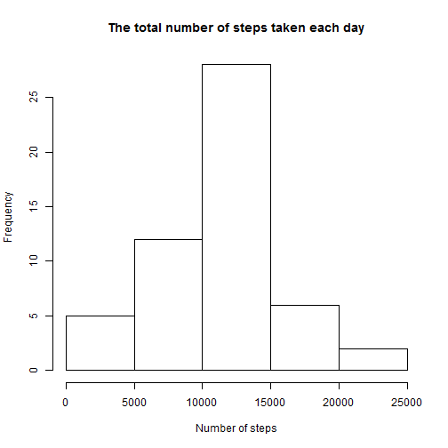
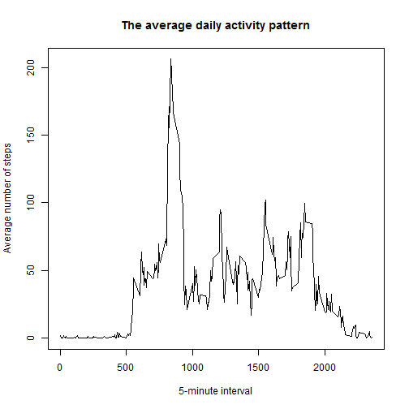
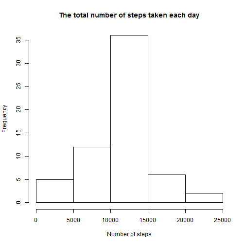
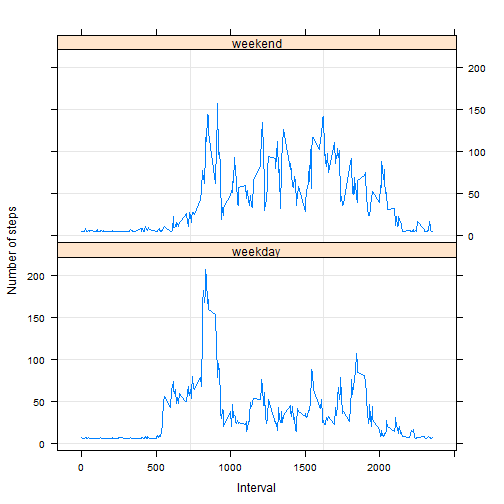

## This assignment will be described in multiple parts

### Loading and preprocessing the data

Loading and preprocessing the data


```r
data<-read.csv("activity.csv",header=TRUE,stringsAsFactors=FALSE,colClasses=c("integer","Date","integer"))
```

### What is mean total number of steps taken per day?

1. Calculate the total number of steps taken per day (Rows with NA value are removed)

```r
total_steps<-with(na.omit(data),tapply(steps,date,sum))
total_steps
```

```
## 2012-10-02 2012-10-03 2012-10-04 2012-10-05 2012-10-06 2012-10-07 
##        126      11352      12116      13294      15420      11015 
## 2012-10-09 2012-10-10 2012-10-11 2012-10-12 2012-10-13 2012-10-14 
##      12811       9900      10304      17382      12426      15098 
## 2012-10-15 2012-10-16 2012-10-17 2012-10-18 2012-10-19 2012-10-20 
##      10139      15084      13452      10056      11829      10395 
## 2012-10-21 2012-10-22 2012-10-23 2012-10-24 2012-10-25 2012-10-26 
##       8821      13460       8918       8355       2492       6778 
## 2012-10-27 2012-10-28 2012-10-29 2012-10-30 2012-10-31 2012-11-02 
##      10119      11458       5018       9819      15414      10600 
## 2012-11-03 2012-11-05 2012-11-06 2012-11-07 2012-11-08 2012-11-11 
##      10571      10439       8334      12883       3219      12608 
## 2012-11-12 2012-11-13 2012-11-15 2012-11-16 2012-11-17 2012-11-18 
##      10765       7336         41       5441      14339      15110 
## 2012-11-19 2012-11-20 2012-11-21 2012-11-22 2012-11-23 2012-11-24 
##       8841       4472      12787      20427      21194      14478 
## 2012-11-25 2012-11-26 2012-11-27 2012-11-28 2012-11-29 
##      11834      11162      13646      10183       7047
```

2. The histogram of the total number of steps taken each day


```r
hist(total_steps,main="The total number of steps taken each day",xlab="Number of steps")
```

 

3. The mean and median of the total number of steps per day

```r
mean(total_steps)
```

```
## [1] 10766.19
```

```r
median(total_steps)
```

```
## [1] 10765
```

### What is the average daily activity pattern?

1. Make a time series plot (i.e. `type = "l"`) of the 5-minute interval (x-axis) and the average number of steps taken, averaged across all days (y-axis).

Firstly, we need to calculate the mean value of steps based on interval values on different days. In other words, we need to find the mean of steps on interval "5", "10", "25" and so on. This can be done with below code:


```r
meansteps<-with(na.omit(data),tapply(steps,interval,mean))
```
The **meansteps** variable contains 288 values with names. Its Values are mean of steps and names are "5", "10", "15"... We can check its content with `head(meansteps)` command. Then, We assign its names to new variable called **intervals**


```r
head(meansteps)
```

```
##         0         5        10        15        20        25 
## 1.7169811 0.3396226 0.1320755 0.1509434 0.0754717 2.0943396
```

```r
intervals<-names(meansteps)
```
Finally, we create a plot for intervals and meansteps variables with `type="1"`


```r
plot(intervals, meansteps, type="l",main="The average daily activity pattern",ylab="Average number of steps",xlab="5-minute interval")
```

 

2. Which 5-minute interval, on average across all the days in the dataset, contains the maximum number of steps?

To answer this question, we firstly find which row in meansteps variable contains the maximum number of steps (on average). Then, the answer is the name (interval) of that row.


```r
names(which(meansteps==max(meansteps)))
```

```
## [1] "835"
```

The output above means that interval **835** contains the maximum number of steps.

###Imputing missing values

1. Calculate and report the total number of missing values in dataset.

To check the missing values in dateset, we can use `is.na()` command with aargument is dataset. Its returns are logical values `TRUE` or `FALSE`. **TRUE** return means that we have missing value at that observation. Therefore, the total number of **TRUE** returns is the total number of missing values. We can simply do it by putting `is.na()` inside `sum()` command as below. 


```r
sum(is.na(data))
```

```
## [1] 2304
```
The answer is 2304 missing values in the dataset.

2. Devise a strategy for filling in all of the missing values in the dataset.

In this case, we can use the mean of steps recorded in days/intervals where we have completed values (non-missing values)


```r
mean(data$steps,na.rm=TRUE)
```

```
## [1] 37.3826
```

3. Create a new dataset that is equal to the original dataset but with the missing data filled in.

We replicate the original dataset and name it **data1**. The missing values in new dataset is filled with mean value we calculated in step 2

```r
data1<-data
data1[is.na(data1)]<-mean(data1$steps,na.rm=TRUE)
```

4. Make a histogram of the total number of steps taken each day and Calculate and report the **mean** and **median** total number of steps taken per day. Do these values differ from the estimates from the first part of the assignment? What is the impact of imputing missing data on the estimates of the total daily number of steps?

We repeat the steps we did in Part 2 with new variable **total_steps2**


```r
total_steps2<-with(data1,tapply(steps,date,sum))
total_steps2
```

```
## 2012-10-01 2012-10-02 2012-10-03 2012-10-04 2012-10-05 2012-10-06 
##   10766.19     126.00   11352.00   12116.00   13294.00   15420.00 
## 2012-10-07 2012-10-08 2012-10-09 2012-10-10 2012-10-11 2012-10-12 
##   11015.00   10766.19   12811.00    9900.00   10304.00   17382.00 
## 2012-10-13 2012-10-14 2012-10-15 2012-10-16 2012-10-17 2012-10-18 
##   12426.00   15098.00   10139.00   15084.00   13452.00   10056.00 
## 2012-10-19 2012-10-20 2012-10-21 2012-10-22 2012-10-23 2012-10-24 
##   11829.00   10395.00    8821.00   13460.00    8918.00    8355.00 
## 2012-10-25 2012-10-26 2012-10-27 2012-10-28 2012-10-29 2012-10-30 
##    2492.00    6778.00   10119.00   11458.00    5018.00    9819.00 
## 2012-10-31 2012-11-01 2012-11-02 2012-11-03 2012-11-04 2012-11-05 
##   15414.00   10766.19   10600.00   10571.00   10766.19   10439.00 
## 2012-11-06 2012-11-07 2012-11-08 2012-11-09 2012-11-10 2012-11-11 
##    8334.00   12883.00    3219.00   10766.19   10766.19   12608.00 
## 2012-11-12 2012-11-13 2012-11-14 2012-11-15 2012-11-16 2012-11-17 
##   10765.00    7336.00   10766.19      41.00    5441.00   14339.00 
## 2012-11-18 2012-11-19 2012-11-20 2012-11-21 2012-11-22 2012-11-23 
##   15110.00    8841.00    4472.00   12787.00   20427.00   21194.00 
## 2012-11-24 2012-11-25 2012-11-26 2012-11-27 2012-11-28 2012-11-29 
##   14478.00   11834.00   11162.00   13646.00   10183.00    7047.00 
## 2012-11-30 
##   10766.19
```

```r
hist(total_steps2,main="The total number of steps taken each day",xlab="Number of steps")
```

 


```r
mean(total_steps2)
```

```
## [1] 10766.19
```

```r
median(total_steps2)
```

```
## [1] 10766.19
```
We can see that the mean value of new dataset is same the mean value of original dataset. It is because we filled the missing values with mean value of non-missing values. The median value is equal to mean value.

###Are there differences in activity patterns between weekdays and weekends?

1. Create a new factor variable in the dataset with two levels - "weekday" and "weekend" indicating whether a given date is a weekday or weekend day.

Firstly, we creat new character variable named **day** with the values are the returns of `weekdays()` command showing that which day of the date in specified year. For instance, the date `2012-10-01` is "Monday" or "Tuesday"... Secondly, We check whether that day is **weekday** or **weekend** by using `%in%` command with the lists of weekday ("Monday","Tuesday","Wednesday","Thursday","Friday") and weekend ("Saturday","Sunday"). Then we replace them with "weekday" or "weekend" accordingly. Finally, we convert this variable into factor variable with `as.factor()` command.


```r
data1[,"day"]<-weekdays(data$date)
data1[data1$day %in% c("Monday","Tuesday","Wednesday","Thursday","Friday"),"day"]<-"weekday"
data1[data1$day %in% c("Saturday","Sunday"),"day"]<-"weekend"
data1$day<-as.factor(data1$day)
```
Now, we look at first and last 6 observations of data1 dataset


```r
head(data1)
```

```
##     steps       date interval     day
## 1 37.3826 2012-10-01        0 weekday
## 2 37.3826 2012-10-01        5 weekday
## 3 37.3826 2012-10-01       10 weekday
## 4 37.3826 2012-10-01       15 weekday
## 5 37.3826 2012-10-01       20 weekday
## 6 37.3826 2012-10-01       25 weekday
```

```r
tail(data1)
```

```
##         steps       date interval     day
## 17563 37.3826 2012-11-30     2330 weekday
## 17564 37.3826 2012-11-30     2335 weekday
## 17565 37.3826 2012-11-30     2340 weekday
## 17566 37.3826 2012-11-30     2345 weekday
## 17567 37.3826 2012-11-30     2350 weekday
## 17568 37.3826 2012-11-30     2355 weekday
```

2. Make a panel plot containing a time series plot (i.e. type = "l") of the 5-minute interval (x-axis) and the average number of steps taken, averaged across all weekday days or weekend days (y-axis).

We need to creat a dataset in which we have the average number of steps taken on different 5-minute intervals and on different days (weekdays or weekends), and we can to this by using `aggragate()` command to apply `mean()` command to **steps** variable and group them by **interval** and **day** variables.

To make a panel plot as required, we can use `xyplot()` function with below arguments in `"lattice"` library.


```r
agg_data<-aggregate(data1$steps,list(interval=data1$interval,day=data1$day),mean)
library("lattice")
xyplot(x ~ interval | day,
       data = agg_data, ylab="Number of steps", xlab = "Interval",
       layout = c(1,2),
       panel = function(x, y) {
         panel.grid(h = -1, v = 2)
         panel.xyplot(x, y, type = "l")
       })
```

 


